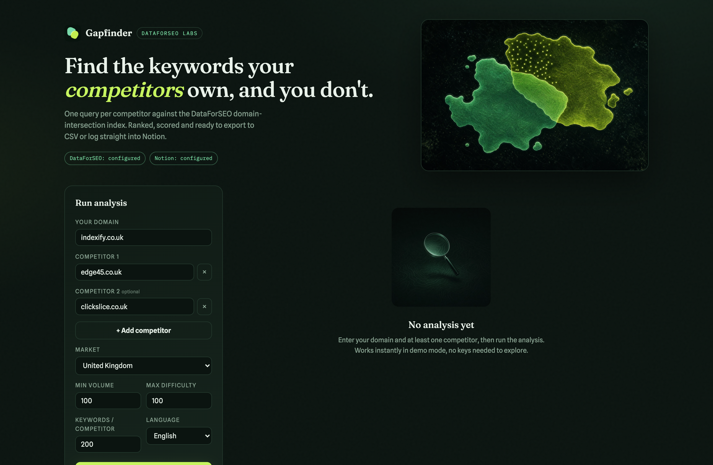
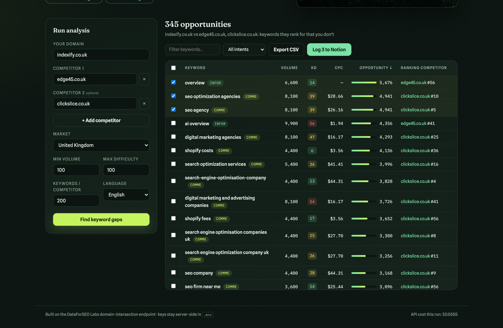
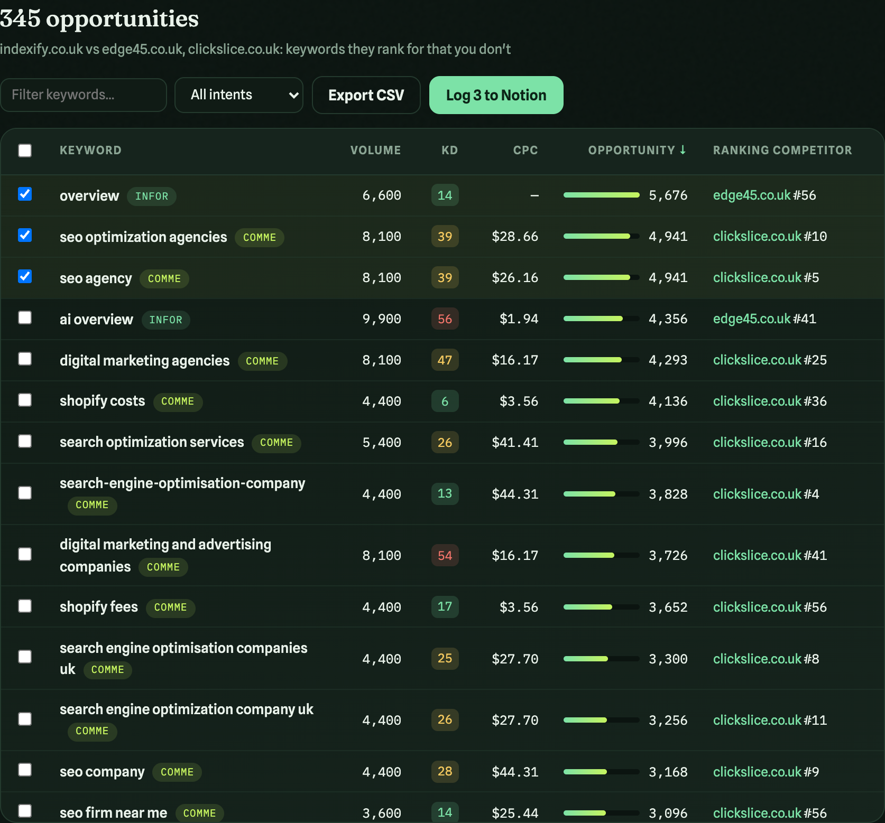

# Find the Keywords Your Competitors Own (Without Needing n8n)


DataForSEO published a clever n8n template recently: [Find Competitor Keyword Gaps and Log Opportunities to Notion](https://dataforseo.com/templates/find-competitor-keyword-gaps-and-log-opportunities-to-notion-with-dataforseo-n8n/). It pulls the keywords your competitors rank for, removes the ones you already rank for, and logs what's left to a Notion database for content planning.

It's a great workflow. But it assumes you run n8n, and plenty of people don't want to maintain an automation server just to answer one question: **which keywords do my competitors own that I don't?**

So I built the same procedure as a standalone tool. One Node.js app, a clean interface, no n8n anywhere in the process. Enter your domain and your competitors, hit run, and you get a scored, sortable list of keyword gaps you can export to CSV or push straight into Notion.

This is the full setup guide. Follow it step by step and you'll have it running in about ten minutes.



## What the tool actually does

The logic is simple to describe and easy to get wrong:

1. For each competitor, the tool asks DataForSEO Labs for keywords where that competitor has an organic result **and your domain has none**. This uses the `domain_intersection` endpoint with `intersections: false`, so the subtraction happens inside DataForSEO's index. One API call per competitor, instead of pulling two full keyword lists and diffing them yourself.
2. Results from all competitors are merged into one row per keyword, enriched with search volume, keyword difficulty, CPC, search intent, and the best-ranking competitor with a link to their page.
3. Each keyword gets an **opportunity score**: search volume multiplied by (1 minus difficulty/100). High volume and low difficulty floats to the top, which is exactly where you want to start writing.
4. You filter, sort, select, and either export to CSV or log your picks to Notion.

I verified the core claim properly before writing this. I pulled the complete list of keywords my own domain ranks for, ran a full unfiltered gap analysis (1,229 keywords from two competitors), and intersected the two lists in code. Overlap: zero. The tool only ever shows you keywords you genuinely don't rank for.

A nice side effect of skipping n8n: your API keys live in one `.env` file on your machine, the exact cost of every run is shown in the app footer, and there's nothing to host.

## What you'll need

- **Node.js 18 or newer** (check with `node --version`)
- **A DataForSEO account** with API access. Sign up at dataforseo.com; new accounts come with trial credit, and a typical two-competitor run costs around $0.06
- **A Notion account** (optional, only if you want the Notion logging)

No DataForSEO account yet? The tool has a built-in demo mode with sample data, so you can install it and explore the whole interface before spending anything.

## Step 1: Get the code and install

```bash
git clone [repository link]
cd keyword-gap-analysis
npm install
```

Two dependencies (Express and dotenv), no build step, nothing else to configure.

## Step 2: Create your environment file

```bash
cp .env.example .env
```

Open `.env` in any editor. This is the only file you'll ever put credentials in, and it never leaves your machine:

```
DATAFORSEO_LOGIN=your_api_login
DATAFORSEO_PASSWORD=your_api_password
NOTION_API_KEY=
NOTION_DATABASE_ID=
PORT=4000
```

Your DataForSEO API credentials are under **API Access** in the DataForSEO dashboard. Note the API password is not your account password.

Leave the Notion lines empty for now; we'll come back to them in Step 4.

## Step 3: Run it

```bash
npm start
```

Open http://localhost:4000. The status chips at the top of the page tell you exactly what's configured. If your DataForSEO keys are missing or wrong, the app drops into demo mode and says so with a banner, so there's never any mystery about whether you're looking at real data.

Enter your domain, add competitors (the "+ Add competitor" button takes you up to ten), pick your market and language, and set your filters:

- **Min volume**: ignore keywords below this monthly search volume
- **Max difficulty**: cap the keyword difficulty (0 to 100)
- **Keywords per competitor**: how many to fetch per competitor (up to 1,000)

Hit **Find keyword gaps**.



Not sure which competitors to enter? Pick the domains that keep appearing above you in the SERPs for your money terms. Your real search competitors are often not who you think they are.

## Step 4 (optional): Set up Notion logging

This is the part people overthink, so here's the short version: **you do not need to build the database columns yourself**. The app checks your database on the first log and creates any missing properties automatically. You just need an empty database and a connection.

1. **Create an integration.** Go to notion.so/my-integrations, click "New integration", give it a name, and copy the secret it generates. That secret goes into `NOTION_API_KEY` in your `.env`.
2. **Create an empty database.** In Notion, make a new page and add a database (full page is tidiest). Give it a name like "Keyword Gap Opportunities". That's it; one default title column is enough.
3. **Connect the integration to the database.** Open the database, click the ⋯ menu in the top right, choose **Connections**, and add your integration. This step is the one everyone forgets, and without it the API returns "not found".
4. **Copy the database ID.** Look at the database URL: `notion.so/yourworkspace/abc123def456...?v=...`. The 32-character string between the last slash and the question mark is the database ID. Paste it into `NOTION_DATABASE_ID`.
5. **Restart the app** (`Ctrl+C`, then `npm start`).

On your first log, the app adds these properties to the database for you: Search Volume, Difficulty, CPC, Opportunity Score, Intent, Competitors, Best Position, Competitor URL, and Status (New / In progress / Published). The keyword itself goes into the title column. Rows are created one page per keyword, so everything works with Notion's filters, boards, and AI features afterwards.

If you'd rather build the columns by hand, use exactly those names and types (numbers for the metrics, selects for Intent and Status, URL for Competitor URL, text for Competitors), but honestly, let the app do it.

## Step 5: Work the list



The results table is where the value is:

- **Sort** by any column. Opportunity score descending is the default and the most useful view.
- **Filter** by keyword text or search intent. Commercial-intent gaps with low difficulty are usually your fastest wins.
- **Tick the keywords you want to act on**, then either **Export CSV** (exports your selection, or the whole filtered view if nothing's selected) or **Log to Notion**, which pushes your picks into the database with Status set to "New".

From there the workflow is the same as the original n8n template: your Notion database becomes the content planning queue, and each keyword carries enough data (volume, difficulty, intent, who ranks and where) to brief a writer without opening another tool.

## What it costs

Every analysis makes one `domain_intersection` call per competitor, and the app shows you the exact cost of each run in the footer. As a guide from my own usage: two competitors at 200 keywords each came to $0.06, and a deliberately heavy verification run (two competitors, 1,000 keywords each, no filters) cost $0.15. You will struggle to spend a pound a week on this.

## Why this beats the spreadsheet version

You could do all of this manually: export competitor keywords from your SEO tool of choice, export your own, VLOOKUP the difference, eyeball the volumes. I did it that way for years. The problem is friction; the manual version happens quarterly at best, and the gaps move faster than that.

When the same answer costs six cents and thirty seconds, you check it weekly. That's the actual win, and it's the same reason the n8n template exists. This version just removes the last dependency.

---

*The tool is built on the DataForSEO Labs API with a Node.js backend and a vanilla JavaScript frontend. The imagery in the app and this article was generated with OpenAI image generation, driven by Codex. If you set it up and hit a snag, leave a comment and I'll help you debug it.*
