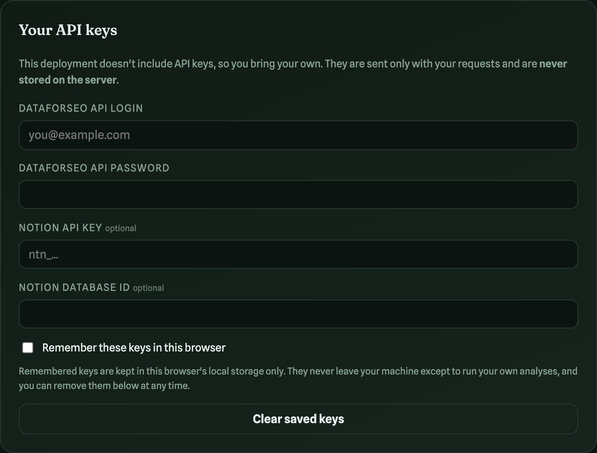

# Find the Keywords Your Competitors Own (Without Needing n8n)


DataForSEO published a clever n8n template recently: [Find Competitor Keyword Gaps and Log Opportunities to Notion](https://dataforseo.com/templates/find-competitor-keyword-gaps-and-log-opportunities-to-notion-with-dataforseo-n8n/). It pulls the keywords your competitors rank for, removes the ones you already rank for, and logs what's left to a Notion database for content planning.

It's a great workflow. But it assumes you run n8n, and plenty of people don't want to maintain an automation server just to answer one question: **which keywords do my competitors own that I don't?**

So I rebuilt the same procedure as a hosted tool. No n8n, no install, nothing to maintain. It's live at **[gapfinder.indexify.co.uk](https://gapfinder.indexify.co.uk)**: enter your domain and your competitors, hit run, and you get a scored, sortable list of keyword gaps you can export to CSV or push straight into Notion.

This guide walks you through it step by step. You'll be looking at your own keyword gaps inside ten minutes, and most of that is creating a DataForSEO account.


## What the tool actually does

The logic is simple to describe and easy to get wrong:

1. For each competitor, the tool asks DataForSEO Labs for keywords where that competitor has an organic result **and your domain has none**. The subtraction happens inside DataForSEO's index, one API call per competitor, rather than pulling two full keyword exports and diffing them in a spreadsheet.
2. Results from all competitors are merged into one row per keyword, enriched with search volume, keyword difficulty, CPC, search intent, and a column per competitor showing their position with a direct link to the exact page you're competing against.
3. Each keyword gets an **opportunity score**: search volume multiplied by (1 minus difficulty/100). High volume and low difficulty floats to the top, which is exactly where you want to start writing.
4. You filter, sort, select, and either export to CSV or log your picks to Notion.

I verified the core claim properly before writing this. I pulled the complete list of keywords my own domain ranks for, ran a full unfiltered gap analysis (1,229 keywords from two competitors), and intersected the two lists in code. Overlap: zero. The tool only ever shows you keywords you genuinely don't rank for.

## A word about keys, because trust matters

The hosted tool holds no API keys and no accounts. You bring your own DataForSEO keys, and they work like this:

- Keys are sent only with your own analysis requests and are **never stored on the server**.
- You can optionally tick "Remember these keys in this browser", which keeps them in your browser's local storage on your machine only.
- One click on "Clear saved keys" removes them whenever you like.
- Before you enter anything at all, the tool runs in **demo mode** with sample data, so you can explore the whole interface for free.



## Step 1: Try it in demo mode

Go to [gapfinder.indexify.co.uk](https://gapfinder.indexify.co.uk), leave the keys panel empty, and hit **Find keyword gaps**. You'll get sample data with a clear banner saying so. This is the whole interface working end to end with nothing entered: sorting, filtering, intent tags, difficulty pills, CSV export.

## Step 2: Get your DataForSEO keys

Sign up at dataforseo.com (new accounts come with trial credit), then go to **API Access** in their dashboard. You need two things: your API login (your email) and the **API password**, which is generated for you and is not your account password.

Paste both into the "Your API keys" panel in the tool. The DataForSEO status chip flips to "configured" as soon as both fields are filled, and your next run is live data. Tick "Remember these keys in this browser" if you don't fancy pasting them every visit.

## Step 3: Run a real analysis

Enter your domain, add competitors with the "+ Add competitor" button (up to ten), pick your market and language, and set your filters:

- **Min volume**: ignore keywords below this monthly search volume
- **Max difficulty**: cap the keyword difficulty (0 to 100)
- **Keywords per competitor**: how many to fetch per competitor (up to 1,000)

Hit **Find keyword gaps**.


Not sure which competitors to enter? Pick the domains that keep appearing above you in the SERPs for your money terms. Your real search competitors are often not who you think they are.

On cost: every run shows its exact API cost in the footer. A two-competitor run at 200 keywords each costs about $0.06. My heaviest test (two competitors, 1,000 keywords each, no filters) cost $0.15. You will struggle to spend a pound a week on this.

## Step 4 (optional): Connect Notion

This is the part people overthink, so here's the short version: **you don't need to build the database columns yourself**. The tool checks your database on the first log and creates any missing properties automatically. You just need an empty database and a connection:

1. **Create an integration.** Go to notion.so/my-integrations, click "New integration", name it, and copy the secret it generates.
2. **Create an empty database.** In Notion, add a new full-page database and call it something like "Keyword Gap Opportunities". One default title column is enough.
3. **Connect the two.** Open the database, click the ⋯ menu in the top right, choose **Connections**, and add your integration. This is the step everyone forgets; without it the API says "not found".
4. **Copy the database ID.** In the database URL, it's the 32-character string between the last slash and the question mark.
5. Paste the secret and the database ID into the Notion fields in the keys panel.

On your first log, the tool adds these properties for you: Search Volume, Difficulty, CPC, Opportunity Score, Intent, Competitors, Best Position, Competitor URL, and Status (New / In progress / Published). Each logged keyword becomes a page, so Notion filters, boards and AI all work on the results.

## Step 5: Work the list


The results table is where the value is:

- **Sort** by any column. Opportunity score descending is the default and the most useful view.
- **Filter** by keyword text or search intent. Commercial-intent gaps with low difficulty are usually your fastest wins.
- **Follow the competitor columns**: each competitor in your analysis gets its own column showing their position and a clickable link to the exact page that's ranking. Open it, see what you're up against, write something better.
- **Tick the keywords you want to act on**, then **Export CSV** or **Log to Notion**, which pushes your picks into the database with Status set to "New".

From there the workflow is the same as the original n8n template: your Notion database becomes the content planning queue, and each keyword carries enough data (volume, difficulty, intent, who ranks and where) to brief a writer without opening another tool.

## Why this beats the spreadsheet version

You could do all of this manually: export competitor keywords from your SEO tool of choice, export your own, VLOOKUP the difference, eyeball the volumes. I did it that way for years. The problem is friction; the manual version happens quarterly at best, and the gaps move faster than that.

When the same answer costs six cents and thirty seconds, you check it weekly. That's the actual win, and it's the same reason the n8n template exists. This version just removes every dependency: no n8n, no install, no keys stored anywhere but your own browser.

## Prefer to run it yourself?

The tool is open source: [github.com/jongoodey/gapfinder](https://github.com/jongoodey/gapfinder). It's a small Node.js app with no build step:

```bash
git clone https://github.com/jongoodey/gapfinder.git
cd gapfinder
npm install
cp .env.example .env   # add your DataForSEO and Notion keys here
npm start              # http://localhost:4000
```

With keys in `.env`, the keys panel disappears and it runs as your own private instance. The repo also includes the Netlify config, so deploying your own hosted copy is connect-and-go.

---

*Built on the DataForSEO Labs API with a Node.js backend and a vanilla JavaScript frontend. The imagery in the tool and this article was generated with OpenAI image generation, driven by Codex. If you try it and hit a snag, leave a comment and I'll help you debug it.*
